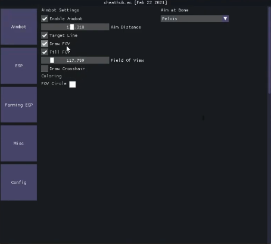

# Cheathub Rust Cheat

## Overview
Cheathub Rust Cheat is a comprehensive cheat solution for the game Rust, providing a wide range of features including ESP (wallhacks), aimbot, and various game exploits. This project works in conjunction with the [cheat-memory-driver](https://github.com/nosfirlabs/cheat-memory-driver/tree/main) to provide kernel-level memory manipulation capabilities.

## ⚠️ Disclaimer
This software is provided for **educational purposes only**. Using this cheat in online games may violate terms of service and could result in your account being banned. The authors are not responsible for any consequences resulting from the use of this software.

## Features

### ESP (Wallhacks)
- Player ESP with customizable options:
  - Bounding boxes (normal and corner)
  - Player names
  - Distance indicators
  - Health bars
  - Skeleton ESP
  - Visibility checks
  - Customizable colors
- Resource ESP:
  - Stone, Metal, and Sulfur ores
  - Hemp, Mushrooms, and other collectables
- Loot ESP:
  - Various crate types (Military, Elite, Normal, etc.)
  - Barrels and airdrops
  - Underwater crates
- Building ESP:
  - Tool cupboards
  - Furnaces and campfires
- Animal ESP:
  - Bears, wolves, horses, etc.
- Vehicle ESP:
  - Cars, boats, helicopters

### Aimbot
- Customizable FOV
- Recoil control system (RCS)
- Bone targeting
- Team check
- Visibility check
- Customizable hotkeys

### Exploits
- No recoil
- Super Eoka (100% success rate)
- Spider-man (climb walls)
- Custom FOV
- Water float (walk on water)

### Miscellaneous
- HWID (Hardware ID) authentication system
- Custom rendering using DirectX 11
- ImGui-based user interface
- Memory pattern scanning

## Technical Details

### Memory Driver Integration
This cheat works in conjunction with the [cheat-memory-driver](https://github.com/nosfirlabs/cheat-memory-driver/tree/main) to provide kernel-level memory access. The driver enables:

- Cross-process memory reading/writing
- Memory protection modifications
- Module base address retrieval
- Memory allocation in the target process

### Implementation Details
- Uses MinHook for function hooking
- DirectX 11 hook for rendering ESP and UI
- IL2CPP and Unity engine integration for game-specific functionality
- Pattern scanning for finding dynamic memory addresses

## Requirements
- Windows 10/11 64-bit
- Visual Studio 2019 or newer for building
- DirectX 11 compatible graphics card
- [cheat-memory-driver](https://github.com/nosfirlabs/cheat-memory-driver/tree/main) must be loaded for full functionality

## Building
1. Clone the repository
2. Open the solution in Visual Studio
3. Set the build configuration to Release x64
4. Build the solution

## Usage
1. Load the cheat-memory-driver using a suitable driver loader
2. Inject the compiled DLL into the Rust process using a DLL injector
3. Press the configured key to open the menu (default: Insert)
4. Configure the cheat settings according to your preferences

## Security Considerations
- The cheat includes an HWID authentication system to prevent unauthorized usage
- String encryption is used to avoid detection by signature-based anti-cheat systems
- The kernel driver provides an additional layer of protection against user-mode anti-cheat detection

## License
See the [LICENSE](LICENSE) file for details.

## Credits
- NosfiR Labs for the cheat-memory-driver
- Contributors to the MinHook, ImGui, and other open-source libraries used in this project
